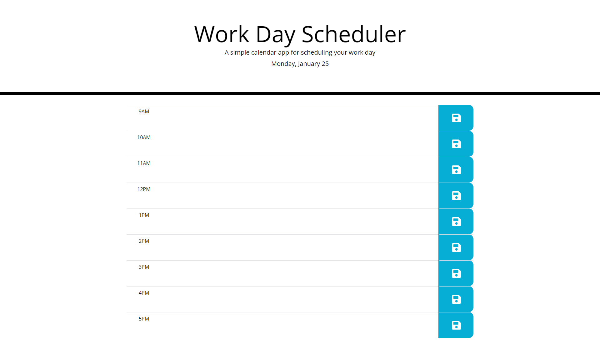

# Work-Day-Scheduler

## Description 

Create a daily planner with time blocks for standard business hours where the user can enter an event and click the save button to save the event. The time blocks are color coded to indicate whether it is in the past, present, or future depending on the current time.

## Screenshot

## URL

https://crrmarchese.github.io/Work-Day-Scheduler/
